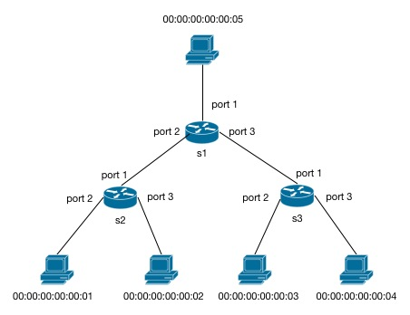

In this exercise, you will write an application that installs rules for forwarding packets along the shortest 
paths in a static network topology. This application is useful because it is essentially the foundation for all 
modern networks.

### The Shortest Path Forwarding Function

This application will accomplish the following:

* It will calculate the all the shortest paths from a source host to every other host in the topology
    * It will do this for every host in the network.
* While the paths are being calculated, it will create forwarding rules for every switch. As you recall from
previous chapters, each rule contains an action and a pattern to match the packet on 
    * For the pattern, we will only need to match on the destination host's MAC address
    * For the action, we will need to know which port on the switch to forward the packet out of
* Once a switch is connected, it will install the rule to forward the packet from the switch to the next
node in the path

You will be using functions from the [Network module] and [Network_Common module] in the
 [ocaml-topology repository].

This application should work with any network topology represented as a Topology object from Network_Common.

### Topology

For simplicity, you will test on the following tree topology: 

The figure shows 5 hosts and 3 switches in a tree topology with depth 2. 

This application should work with any network topology represented as a Topology object from Network_Common.

#### Programming Task

You should use the template below to get started. Save it in a file called  `Routing.ml` and
place it in the directory `~/src/frenetic/ox-tutorial-workspace/Routing.ml`.

~~~ ocaml
 open OxPlatform
 open OpenFlow0x01
 open OpenFlow0x01_Core
 open Network_Common

 module Topology = Net.Topology
 
 module MyApplication = struct

   include OxStart.DefaultTutorialHandlers

   let topology = Net.Parse.from_dotfile "topology.dot"
   
   (* creates Mininet script to generate the topology *)
   let () = 
     let fd = open_out "topology.py" in 
     Printf.fprintf fd "%s" (Net.Pretty.to_mininet topology);
     close_out fd

   let is_host v = 
     match Node.device (Topology.vertex_to_label topology v) with 
     | Node.Host -> true 
     | _ -> false  
  
   (* Creates a list of hosts *)
   let hosts = 
     Topology.VertexSet.filter is_host (Topology.vertexes topology)

   (* [FILL] Install rules for each switch *)
   let switch_connected (sw: switchId) (feats : SwitchFeatures.t) : unit = 
     ()
    
   (* [FILL] drop all packets that reach the controller *)
   let packet_in (sw : switchId) (xid : xid) (pk : packetIn) : unit =
     ()

 end
  
 module Controller = OxStart.Make (MyApplication)
~~~

Your tasks:

* To calculate the shortest paths, you will use the function UnitPath.all_shortest_paths from Network.ml which will 
return a hashtable mapping a node to its predecessor in the path. 
    * You will calculate these paths for every host in the network 
* To create the rules, you will need to use the function Topology.vertex_to_label to get the information associated with 
each node such as the switch id for switches and MAC address for hosts. Also, you might need to use the functions 
Topology.find_edge and Topology.edge_src to get the edge between two nodes or to get the source node at the end of 
the edge 
* Finally, you would need to install the rule associated with each switch as it becomes connected
* Packets that reached the controller should be dropped

You may find that breaking down each task into several helper functions will assist you in debugging and organizing
your code.

#### Compiling and Testing

 * Build and launch the controller:
 
       $ make Routing.d.byte
       $ ./Routing.d.byte
 

 Launching the controller should produce a Mininet python script `topology.py` which you will use to start Mininet.

 * Start Mininet in a separate terminal window:

       $ sudo mn --custom topology.py
 
 * First, test all-pairs connectivity:

       mininet> pingall

 You should see that 0% of the packets have been dropped.

 * Dump flows on switch 1:

       mininet> sh ovs-ofctl dump-flows s1

 * You should receive an output similar to this:

       NXST_FLOW reply (xid=0x4):
        cookie=0x0, duration=90.133s, table=0, n_packets=6, n_bytes=588, idle_age=85, 
       priority=100,dl_dst=00:00:00:00:00:01 actions=output:2
        cookie=0x0, duration=90.133s, table=0, n_packets=8, n_bytes=784, idle_age=85, 
       priority=100,dl_dst=00:00:00:00:00:05 actions=output:1
        cookie=0x0, duration=90.133s, table=0, n_packets=6, n_bytes=588, idle_age=85, 
       priority=100,dl_dst=00:00:00:00:00:02 actions=output:2
        cookie=0x0, duration=90.133s, table=0, n_packets=6, n_bytes=588, idle_age=85, 
       priority=100,dl_dst=00:00:00:00:00:04 actions=output:3
        cookie=0x0, duration=90.133s, table=0, n_packets=6, n_bytes=588, idle_age=85, 
       priority=100,dl_dst=00:00:00:00:00:03 actions=output:3

 Check to see that the packets are being forwarded out of the correct port based on
 their MAC address destination. You can dump the flows on all switches to ensure that
 packets are being forwarded along the shortest paths. 
 

 
