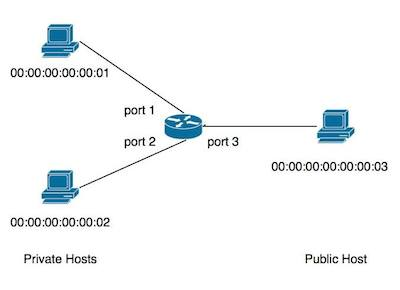

In this exercise, we will build a Network Address Translator (NAT) by
first writing and testing a translator function that first translates
IP addresses and then extending it so that it translates port numbers
as well.

### The Network Address Translating Function

The explosive growth of the Internet in the early 1990s created a
demand for IP addresses, which are limited to 32 bits. NAT allows
private IP addresses to be reused in multiple networks by multiplexing
several private addresses onto a single public address. More
specifically, a NAT device works as follows:

* For packets received on a private (internal) port, it rewrites the
  IP address to the public address, forwards the packet on the public
  port, and records the packet and private port in a persistent store
  such as a hash table.

* For traffic on the public (external) port, it checks to see whether
  the packet is a response to a previous outgoing packet by doing a
  lookup in the persistent store. If so, it rewrites the public
  address to the private address and forwards it to the corresponding
  private port. If not, it drops the packet. 

### Topology

You will work with the following network topology:

It has two private hosts and a public host connected to a single
switch. This topology can be easily created using Mininet:

~~~
$ sudo mn --controller=remote --topo=single,3 --mac --arp
~~~

#### Programming Task

Use the template below to get started. Save it in a file called
`Nat1.ml` and place it in the directory `~/src/frenetic/ox-tutorial-workspace/Nat1.ml`.

~~~ ocaml
(* ~/src/frenetic/ox-tutorial-workspace/Nat1.ml *)

open OxPlatform
open Packet
open OpenFlow0x01_Core

module MyApplication = struct

  include OxStart.DefaultTutorialHandlers

  let mappings = Hashtbl.create 50

  let publicIP = 167772259l
  let publicMAC = 153L

  let privateIP1 = 167772161l

  let privateIP2 = 167772162l

   let switch_connected (sw:switchId) feats : unit =
     Printf.printf "Switch Connected %Ld\n%!" sw

  let packet_in (sw: switchId) (xid : xid) (pktIn : packetIn) : unit =
    let pk = parse_payload pktIn.input_payload in
      (* If the packet is of type TCP and came in through port 1 or 2 *)
      if (pktIn.port = 1 || pktIn.port = 2)
        && Packet.dlTyp pk = 0x800
        && Packet.nwProto pk = 0x06
      then
	(* [FILL] Add packet info into hashtable and install rules to
           forward packet out of correct port *)
        ...
      else (* For packets arriving on port 3 *)
	try (* If a mapping is found in the hashtable *)
          Printf.printf "Non TCP or incoming flow %s \n" (packetIn_to_string pktIn);
          (* [FILL] Install reverse rules to forward packet back to correct host *)
          ...
        with Not_found ->
	  (* [FILL] If no mapping is found in hashtable then drop the packet *)
          ...
end

module Controller = OxStart.Make (MyApplication)

~~~

#### Building and Testing

To ensure that TCP packets are being sent and received to the correct
hosts and addresses are translated correctly, perform the following
steps.

 * Start Mininet:

       $ sudo mn --controller=remote --topo=single,3 --mac --arp

 * In a separate terminal window, build and launch the controller:

       $ oxbuild Nat1.native
       $ ./Nat1.native

 * In Mininet, start new terminals for `h1`, `h2`, and `h3`:

       mininet> xterm h1 h2 h3

 * In the terminal for `h3`, add static entries into the arp table for
   the public IP address, and start a fortune server.

       # arp -v -s [public IP address] [public MAC address]
       # while true; do fortune | nc -l 80; done
  
* In the terminal for `h1`, fetch a fortune from `h3`.

      # curl 10.0.0.3:80

  You should’ve received a fortune. Now try to fetch a fortune on the `h2` terminal.

* In the terminal for the controller, check to see that your IP addresses are translating
  correctly.

  ~~~
  Outgoing flow packetIn{
   total_len=74 port=1 reason=NoMatch
   payload=dlSrc=00:00:00:00:00:01,dlDst=00:00:00:00:00:03,
   nwSrc=10.0.0.1,nwDst=10.0.0.3,tpSrc=42635;tpDst=80 (buffered at 256)

  Translating Private IP:167772161 to Public IP:167772259.
  ~~~
 
* Incoming packets should look similar to this:

  ~~~
  Non TCP or incoming flow packetIn{
   total_len=74 port=3 reason=NoMatch
   payload=dlSrc=00:00:00:00:00:03,dlDst=00:00:00:00:00:099,
   nwSrc=10.0.0.3,nwDst=10.0.0.99,tpSrc=80;tpDst=42635 (buffered at 257)
   }
  Found a mapping in the hashtable!
  ~~~
  
  Notice how this packet matches the outgoing flow packet above.

### Port Translatation

The scheme we have implemented so far works as long as the private
hosts never initiate simultaneous flows with the same TCP source
port. To relax this assumption, we can use the controller to rewrite
the TCP source ports to unique values and prevent conflicts. 

#### Programming Task

Modify Nat1.ml to translate port numbers as well.

More specifically,

* On each outgoing flow, generate a fresh public TCP source port.

* For packets received on internal ports, rewrite the original TCP
  source port number with the generated port number of the host.

* For packets received on the external port, rewrite the assigned TCP
  destination port number with the original TCP destination port
  number.

#### Building and Testing

Compile and test the controller the same way as before.

* In the terminal for the controller, check to see that your IP
  addresses and port numbers are translating correctly.

  ~~~
  Outgoing flow packetIn{
   total_len=74 port=1 reason=NoMatch
   payload=dlSrc=00:00:00:00:00:01,dlDst=00:00:00:00:00:03,
   nwSrc=10.0.0.1,nwDst=10.0.0.3,tpSrc=42635;tpDst=80 (buffered at 256)
   }
  Translating Private IP:167772161:42635 to Public IP:167772259:5000.
  ~~~

* Incoming packets should look similar to this:

  ~~~
  Non TCP or incoming flow packetIn{
   total_len=74 port=3 reason=NoMatch
   payload=dlSrc=00:00:00:00:00:03,dlDst=00:00:00:00:00:099,
   nwSrc=10.0.0.3,nwDst=10.0.0.99,tpSrc=80;tpDst=5000 (buffered at 257)
   }
  Found a mapping in the hashtable!
  ~~~

